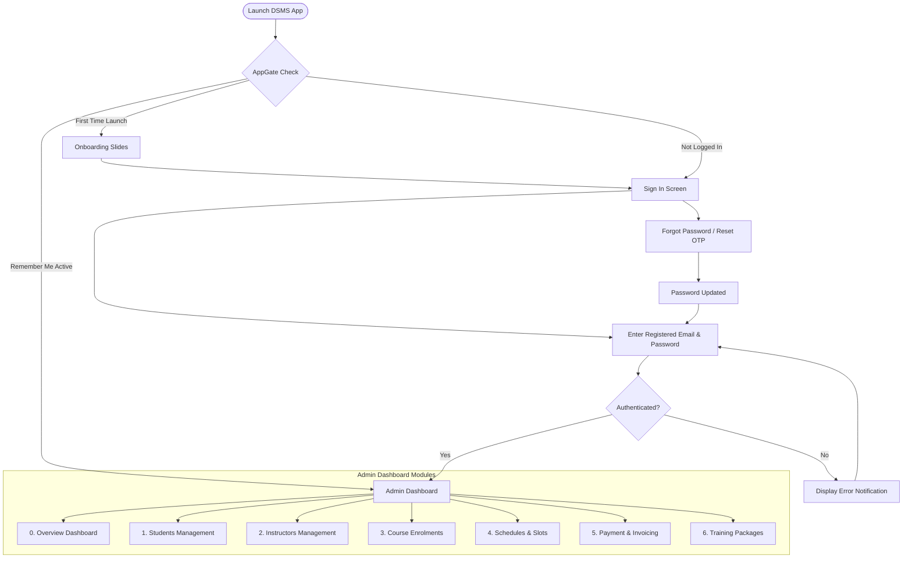
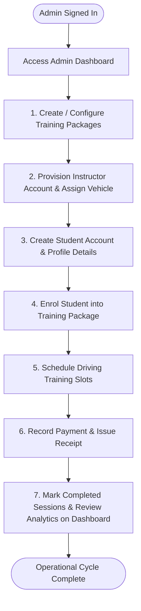

# DSMS - Admin System Architecture & Operational Flows

This document contains visual operational flows for the **DSMS (Driving School Management System)** focused on **Administrator Operations**.

> [!TIP]
> **How to edit these diagrams visually in Draw.io:**
> 1. Open **[Draw.io (app.diagrams.net)](https://app.diagrams.net)**.
> 2. Click **`+` (Insert)** in the top toolbar $\rightarrow$ **`Advanced`** $\rightarrow$ **`Mermaid`**.
> 3. Copy any of the Mermaid code blocks below and paste it into Draw.io.
> 4. Click **Insert** to generate fully customizable drag-and-drop vector diagrams.

---

## 1. Master Admin Navigation & Auth Flow

---

## 2. Complete Admin Operational Lifecycle Flow

